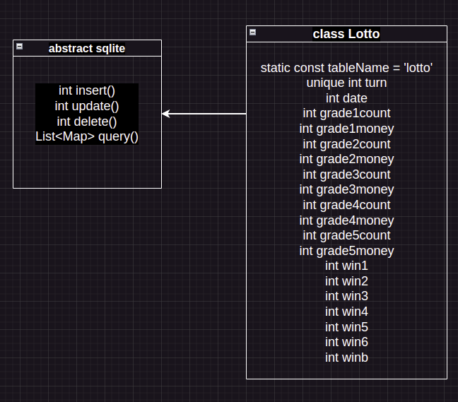
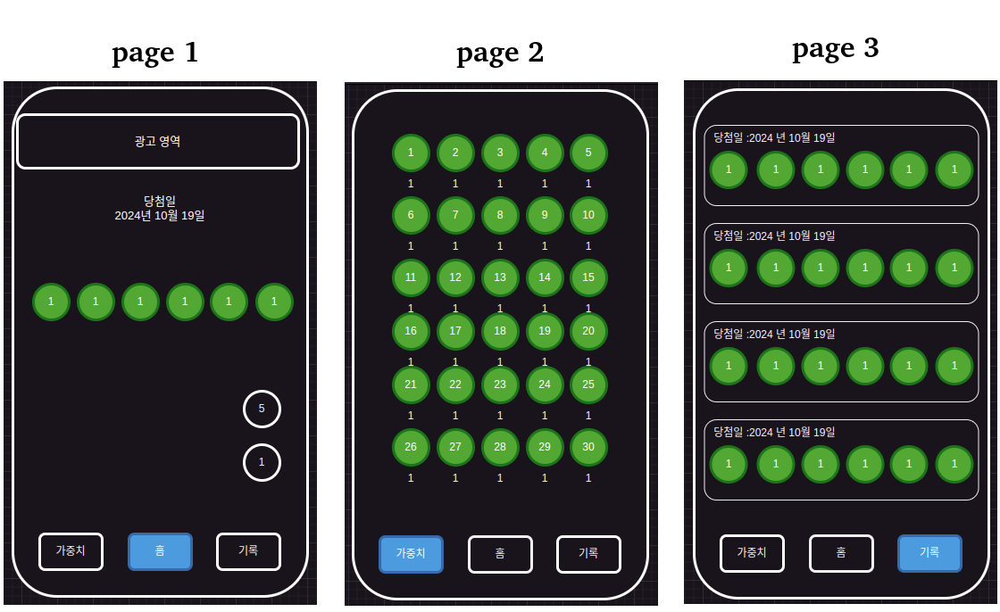
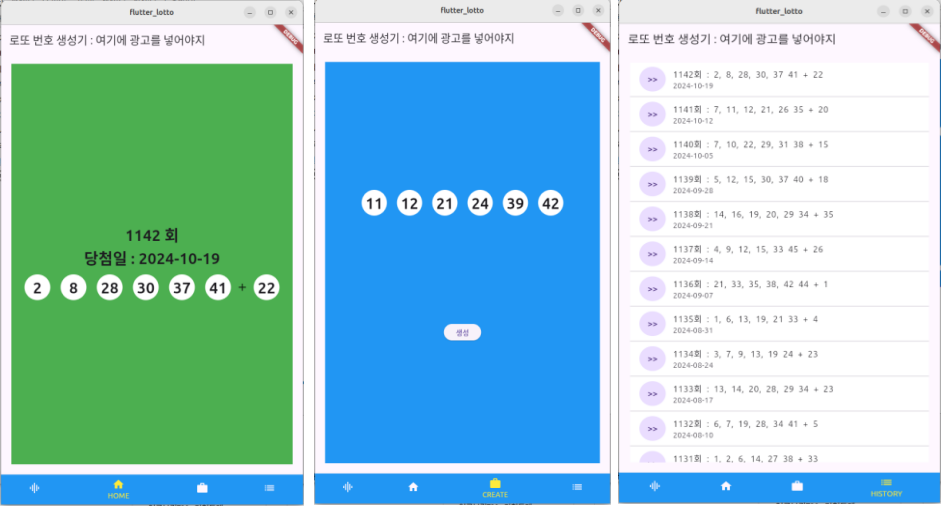

# 제목 : flutter_lotto
## 부제 : 플러터 기반의 로또 번호 생성기

***

## project flow
1. ### 깃 저장소 생성 및 연동 20241020
2. ### [사용자 요구사항 수집 20241020](#사용자-요구사항)
3. ### [프로젝트 기획 20241020](#프로젝트-개요-및-기획)
4. ### [화면 구상 및 모델 정의 20241021](#화면-구상-및-모델-정의)
5. ### [프로그램 구현 20241022](#프로그램-구현)
6. ### 테스트 및 배포
7. ### 광고 삽입

***

### 사용자 요구사항
- #### 당첨번호를 확인 할 수 있다. (금주, 이전 이력)
> - 메인 화면에 금주 당첨번호를 보여준다.
> - 이전이력은 최근 것 부터 리스트형식으로 볼 수 있다. 
- #### 추천번호를 생성 할 수 있다. 
> - 1 ~ 45 까지의 중복되지 않는 번호 6개 = 1회
> - 1회 생성
> - 5회 생성
- #### 추천번호 생성 시 가중치를 줄 수 있다.
> - 기본적(default)으로 이전 당첨번호들의 누적으로 가중치를 생성한다.
> - 기본적으로 이전 당첨번호 10회 정도의 누적을 사용한다.

***

### 프로젝트 개요 및 기획
- #### 플러터를 학습하여 연습삼아 프로젝트를 진행하는데 주제는 로또 번호 생성기이다.
- #### 사용자 : 본인
- #### 개발 환경 : 우분투 & vscode & 안드로이드 스튜디오
- #### 개발 언어 : Dart & Flutter
- #### 타겟 디바이스 : 안드로이드
- #### 데이터베이스 : Sqlite
- #### 일정 : 아직 학원 수업을 듣는 중이므로 기간이 늘어 질 수있다.
> 1. 기획 : 1일
> 2. 화면 구성 및 모델 구성 : 1일
> 3. 프로그램 구현 : 2일 (플러터로 앱제작이 처음이라 1일 추가 했음)
> 4. 테스트 및 배포 : 2일 (플레이스토어 배포를 해본적이 없어서 1일 추가 했음)
> 5. 광고 삽입 : 2일 (구글에드센스를 적용 해 본적이 없어서 1일 추가 했음)
> 6. 총 : 8일
- #### 예산 : 8일수 * 30인건비 * 3마진 = 720만원

***

### 화면 구상 및 모델 정의
```
// 플러터 프로젝트 생성
flutter create . 
```
- #### [동행복권 당첨번호][win]
[win]: https://m.dhlottery.co.kr/gameResult.do?method=byWin "동행복권 홈페이지 바로가기"
- #### vscode 확장 설치 : Draw.io Integration


***

### 프로그램 구현
- #### sqlite 쓰려다가 데이터가 극히 소량이라 csv 파일로 변경함
- #### 최근 당첨 번호 페이지 구현
- #### 최근 10일 당첨번호 기준으로 가중치 적용한 추천번호 생성 페이지 구현
- #### 당첨번호 이력 페이지 구현

***

### 테스트 및 배포

***

### 광고 삽입


